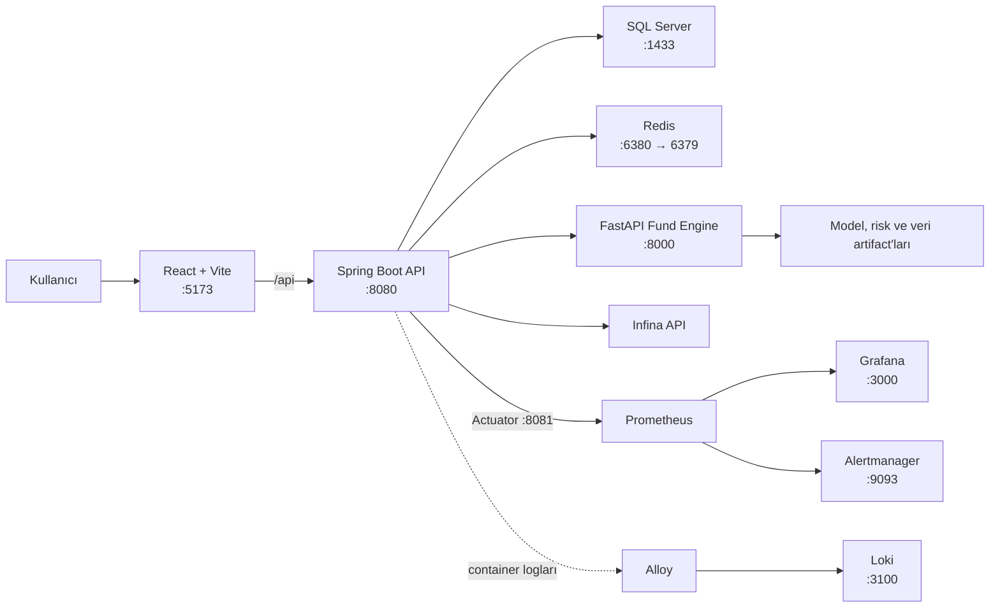

# Finovation
Bu proje, **İnfina Akademi** kapsamında geliştirilmiş ve programın **en başarılı projesi** seçilmiştir. Sürece katkı sunan tüm ekip arkadaşlarıma teşekkürlerimle...

Finovation; fon tasarımı, portföy optimizasyonu, fon izleme ve stres testi süreçlerini tek bir uygulamada birleştiren, yapay zekâ destekli bir portföy karar destek platformudur. Sistem; React tabanlı web arayüzü, Spring Boot iş katmanı ve paketlenmiş tahmin/optimizasyon modellerini sunan FastAPI servisiyle birlikte çalışır.

> [!IMPORTANT]
> AI servisindeki tahmin ve portföy karar motoru `2025-05-29` sistem tarihine ve `2025-05-28` tahmin başlangıç tarihine ait dondurulmuş V3 snapshot'ını kullanır. Bu paket canlı piyasa tahmini üretmez; tekrar üretilebilir model sonuçları sunar.

## İçindekiler

- [Öne çıkan özellikler](#öne-çıkan-özellikler)
- [Mimari](#mimari)
- [Teknoloji yığını](#teknoloji-yığını)
- [Proje yapısı](#proje-yapısı)
- [Hızlı başlangıç](#hızlı-başlangıç)
- [Servis adresleri](#servis-adresleri)
- [Yerel geliştirme](#yerel-geliştirme)
- [Yapılandırma](#yapılandırma)
- [API özeti](#api-özeti)
- [Test ve kalite kontrolleri](#test-ve-kalite-kontrolleri)
- [İzleme ve loglama](#izleme-ve-loglama)
- [Üretim ortamı](#üretim-ortamı)
- [Sorun giderme](#sorun-giderme)
- [Ek dokümantasyon](#ek-dokümantasyon)

## Öne çıkan özellikler

- Rol tabanlı erişim: `USER`, `COMPANY_MANAGER` ve `ADMIN`
- JWT access/refresh token akışı, oturum yenileme ve güvenli çıkış
- OTP tabanlı parola sıfırlama ve ilk girişte parola değiştirme zorunluluğu
- Şirket ve kullanıcı yönetimi
- Fon taslağı oluşturma, düzenleme, arşivleme, sabitleme ve çalışma portföyü yönetimi
- 3, 6 ve 12 aylık model tahminleriyle fon önerileri oluşturma
- Mevcut portföyleri kısıtlar altında optimize etme, sonuç onaylama/reddetme ve denetim kayıtları
- Deterministik senaryolar ve PPO politikalarıyla stres testi
- Fon performansı ve risk metriklerini izleme
- PDF ve Excel rapor dışa aktarma
- Infina üzerinden referans ve piyasa verisi senkronizasyonu
- Prometheus, Grafana, Loki, Alloy ve Alertmanager tabanlı gözlemlenebilirlik

## Mimari



Tarayıcı yalnızca backend API'siyle iletişim kurar. Spring Boot servisi iş kurallarını, yetkilendirmeyi, kalıcı veriyi ve dış servis orkestrasyonunu yönetir. Python servisi ise paketlenmiş model artifact'larını yükleyerek tahmin, CREATE/OPTIMIZE ve RL inference işlemlerini gerçekleştirir.

## Teknoloji yığını

| Katman | Teknolojiler |
|---|---|
| Web | React 19, TypeScript, Vite 8, React Router, Zod, Recharts |
| Backend | Java 21, Spring Boot 4.1, Spring Security, Spring Data JPA, Flyway, Resilience4j |
| AI/ML | Python 3.11, FastAPI, LightGBM, CatBoost, scikit-learn, PyTorch, Stable-Baselines3 |
| Veri | Microsoft SQL Server 2022, Redis 7, Parquet |
| Gözlemlenebilirlik | Spring Actuator, Prometheus, Grafana, Loki, Alloy, Alertmanager |
| Dağıtım | Docker Compose, Caddy, Nginx, Gitea Actions |
| Test | JUnit, Testcontainers, Vitest, Testing Library, pytest |

## Proje yapısı

```text
Finovation/
├── finovation-fe/          # React/TypeScript web uygulaması
├── finovation-be/          # Spring Boot REST API ve iş kuralları
├── finovation-ai/          # FastAPI model ve optimizasyon servisi
│   ├── api/                # HTTP API, şemalar ve runtime
│   ├── artifacts/          # Paketlenmiş model/risk artifact'ları
│   ├── configs/            # Model registry ve portföy kuralları
│   ├── contracts/          # OpenAPI ve Java entegrasyon sözleşmeleri
│   ├── data/               # Dondurulmuş inference veri setleri
│   └── src/                # Tahmin, portföy ve stres motorları
├── monitoring/             # Prometheus, Grafana, Loki ve Alertmanager ayarları
├── docker-compose.yml      # Yerel geliştirme ortamı
└── README.md                # Proje rehberi
```

Alt projelerin kendi README dosyaları, ilgili katmanın ayrıntılı çalışma modelini açıklar.

## Hızlı başlangıç

### Gereksinimler

- Git
- Docker Engine veya Docker Desktop
- Docker Compose v2
- En az 8 GB RAM; model servisinin rahat çalışması için 12 GB ve üzeri önerilir

Servisleri Docker dışında çalıştıracaksanız ayrıca Java 21, Node.js `22.22+`, npm ve Python `3.11.x` gerekir.

### 1. Ortam dosyasını hazırlayın

PowerShell:

```powershell
Copy-Item .env.production.example .env
```

Bash:

```bash
cp .env.production.example .env
```

`.env` içindeki örnek değerleri değiştirin. Yerel Compose ortamının en az şu değerleri kullanıma hazır olmalıdır:

```dotenv
MSSQL_SA_PASSWORD=<SQL Server politikasına uygun güçlü parola>
DB_NAME=finovation
JWT_SECRET=<Base64 kodlu güçlü anahtar>
PASSWORD_RESET_SECRET=<Base64 kodlu farklı bir anahtar>
AI_ENGINE_API_KEY=<uzun ve rastgele servis anahtarı>
INFINA_BASE_URL=<Infina servis adresi>
INFINA_API_KEY=<Infina API anahtarı>
MAIL_USERNAME=<SMTP kullanıcı adı>
MAIL_PASSWORD=<SMTP parola veya uygulama parolası>
GRAFANA_ADMIN_USER=admin
GRAFANA_ADMIN_PASSWORD=<güçlü Grafana parolası>
MARKETDATA_BOOTSTRAP_ON_STARTUP=false
```

Gerçek sırları repoya göndermeyin. `.env` ve `.env.production` Git tarafından yok sayılır.

### 2. Alertmanager sırrını hazırlayın

Tüm geliştirme stack'ini başlatacaksanız örnek webhook dosyasını kopyalayın:

```powershell
Copy-Item monitoring/alertmanager/secrets/slack_webhook_url.example `
  monitoring/alertmanager/secrets/slack_webhook_url
```

Slack bildirimi kullanılacaksa dosyadaki örnek URL'yi gerçek Incoming Webhook adresiyle değiştirin. Bu dosya da Git tarafından yok sayılır.

### 3. Servisleri başlatın

Uygulamanın çekirdek servisleri:

```bash
docker compose up -d --build sqlserver mssql-init redis fund-engine backend frontend
```

İzleme bileşenleri dahil tüm yerel stack:

```bash
docker compose up -d --build
```

Durumu ve logları kontrol edin:

```bash
docker compose ps
docker compose logs -f backend fund-engine frontend
```

İlk kurulumda image indirme, Java bağımlılıkları ve Python model paketleri nedeniyle build birkaç dakika sürebilir. SQL Server sağlıklı olduktan sonra `mssql-init` veritabanını oluşturur; backend açılışında Flyway şemayı otomatik olarak günceller.

### 4. Uygulamayı açın

Web arayüzü: [http://localhost:5173](http://localhost:5173)

Hazır olma kontrolleri:

```powershell
Invoke-RestMethod http://localhost:8000/health/ready
Invoke-RestMethod http://localhost:8081/actuator/health
```

Repoda varsayılan kullanıcı parolası veya geliştirme hesabı seed edilmez. Giriş yapabilmek için veritabanında uygulama kurallarına uygun bir kullanıcı bulunmalıdır.

## Servis adresleri

| Servis | Yerel adres | Açıklama |
|---|---|---|
| Frontend | `http://localhost:5173` | Web arayüzü |
| Backend API | `http://localhost:8080/api` | Ana REST API |
| Backend Swagger | `http://localhost:8080/swagger-ui.html` | Yalnızca dev profili |
| Backend OpenAPI | `http://localhost:8080/v3/api-docs` | Yalnızca dev profili |
| Backend Actuator | `http://localhost:8081/actuator/health` | Sağlık ve metrik portu |
| AI Swagger | `http://localhost:8000/docs` | Model servisi dokümantasyonu |
| AI readiness | `http://localhost:8000/health/ready` | Artifact/runtime kontrolü |
| SQL Server | `localhost:1433` | Yerel veritabanı |
| Redis | `localhost:6380` | Host portu; container içinde `6379` |
| Grafana | `http://localhost:3000` | Dashboard'lar |
| Alertmanager | `http://localhost:9093` | Yalnızca localhost'a bağlı |
| Loki | `http://localhost:3100` | Yalnızca localhost'a bağlı |

## Yerel geliştirme

Docker ile yalnızca altyapıyı çalıştırıp uygulama servislerini terminalden başlatabilirsiniz. Aşağıdaki komutlar ilgili alt proje dizininde çalıştırılmalıdır.

### Frontend

```bash
cd finovation-fe
npm ci
npm run dev
```

Frontend varsayılan olarak `/api` isteklerini `http://localhost:8080` adresine yönlendirir. Farklı bir backend için `finovation-fe/.env.example` dosyasını `.env` olarak kopyalayıp `VITE_DEV_PROXY_TARGET` değerini değiştirin.

### Backend

Önce SQL Server ve Redis'i başlatın:

```bash
docker compose up -d sqlserver mssql-init redis
```

Ardından `finovation-be/.env.example` içindeki değişkenleri terminalinize veya IDE run configuration'ınıza aktarın ve çalıştırın.

PowerShell:

```powershell
cd finovation-be
.\mvnw.cmd spring-boot:run
```

Bash:

```bash
cd finovation-be
./mvnw spring-boot:run
```

Backend `.env` dosyasını kendiliğinden yüklemez; değişkenlerin işlem ortamında tanımlı olması gerekir. Model kullanan akışlar için AI servisi de `localhost:8000` üzerinde çalışmalıdır.

### AI servisi

Bağımlılık yönetimi için [uv](https://docs.astral.sh/uv/) önerilir:

```bash
cd finovation-ai
uv sync --frozen
uv run python -m uvicorn api.main:app --host 127.0.0.1 --port 8000
```

PowerShell yardımcı script'leri de kullanılabilir:

```powershell
cd finovation-ai
powershell -ExecutionPolicy Bypass -File .\setup_api.ps1
powershell -ExecutionPolicy Bypass -File .\start_api.ps1 -Port 8000
```

`FUND_ML_API_KEY` tanımlanırsa sağlık endpointleri dışındaki korumalı AI çağrılarında `X-API-Key` başlığı gerekir. Backend tarafındaki `AI_ENGINE_API_KEY` aynı değeri taşımalıdır.

## Yapılandırma

### Temel değişkenler

| Değişken | Amaç | Varsayılan/Not |
|---|---|---|
| `DB_URL`, `DB_USERNAME`, `DB_PASSWORD` | Backend veritabanı bağlantısı | Docker Compose tarafından üretilir |
| `MSSQL_SA_PASSWORD` | Yerel SQL Server yönetici parolası | Zorunlu |
| `REDIS_HOST`, `REDIS_PORT` | Redis bağlantısı | Yerelde `localhost:6380` |
| `JWT_SECRET` | JWT imzalama anahtarı | Zorunlu, Base64 |
| `PASSWORD_RESET_SECRET` | Parola sıfırlama token anahtarı | Belirtilmezse JWT anahtarı kullanılır |
| `AI_ENGINE_API_KEY` | Backend–AI servis kimlik doğrulaması | Üretimde zorunlu |
| `FUND_ENGINE_BASE_URL` | CREATE/OPTIMIZE servis adresi | `http://localhost:8000` |
| `RL_BASE_URL` | RL inference servis adresi | `http://localhost:8000` |
| `INFINA_BASE_URL`, `INFINA_API_KEY` | Dış piyasa verisi servisi | Ortama özel |
| `MAIL_*` | OTP e-posta gönderimi | SMTP ayarları |
| `FINANCIAL_TIME_SIMULATION_ENABLED` | Finansal saat simülasyonu | Yerelde `true`, üretimde `false` olmalı |
| `MARKETDATA_BOOTSTRAP_ON_STARTUP` | Açılışta piyasa verisi yükleme | Dış servise erişim yoksa `false` |
| `VITE_DEV_PROXY_TARGET` | Frontend geliştirme proxy hedefi | `http://localhost:8080` |

Tüm zaman aşımı, rate-limit, cron, fon büyüklüğü ve model snapshot ayarları için `docker-compose.yml` ve `finovation-be/src/main/resources/application.yaml` dosyalarına bakın.

### Finansal zaman simülasyonu

Geliştirme ortamında iş tarihi, sistem saatinden farklı ilerletilebilir:

```dotenv
FINANCIAL_TIME_SIMULATION_ENABLED=true
FINANCIAL_TIME_SYSTEM_ANCHOR_DATE=2026-08-10
FINANCIAL_TIME_FINANCIAL_ANCHOR_DATE=2025-05-29
FINANCIAL_TIME_ZONE=Europe/Istanbul
```

Üretimde gerçek saat için `FINANCIAL_TIME_SIMULATION_ENABLED=false` kullanılmalıdır.

## API özeti

Backend'in ana endpoint grupları:

| Taban yol | Sorumluluk |
|---|---|
| `/api/v1/auth` | Giriş, token yenileme, çıkış ve parola işlemleri |
| `/api/v1/users` | Kullanıcı yönetimi |
| `/api/v1/companies` | Şirket yönetimi |
| `/api/v1/dashboard` | Özet metrikler |
| `/api/v1/fund-drafts` | Fon tasarım akışı ve taslak portföyler |
| `/api/v1/funds` | Fon listesi ve izleme verileri |
| `/api/v1/optimization-requests` | Optimizasyon talebi, çalıştırma ve onay akışı |
| `/api/v1/investment-universe` | Yatırım evreni |
| `/api/v1/stress-scenarios` | Kullanılabilir stres senaryoları |
| `/api/v1/stress-tests` | Deterministik ve RL stres testleri |
| `/api/v1/system-logs` | Sistem denetim/log kayıtları |

AI servisinin temel endpointleri:

| Metot ve yol | Açıklama |
|---|---|
| `GET /health/live` | Süreç liveness kontrolü |
| `GET /health/ready` | Model ve artifact readiness kontrolü |
| `GET /api/v1/metadata` | Snapshot, yatırım evreni ve politika metadata'sı |
| `GET /api/v1/forecasts?horizon=3M` | 3M, 6M veya 12M tahminleri |
| `POST /api/v1/portfolios/create` | İki fon alternatifi üretir |
| `POST /api/v1/portfolios/optimize` | Mevcut portföyü üç alternatife optimize eder |
| `POST /api/v1/rl/inference` | Paketlenmiş PPO politikasıyla stres inference çalıştırır |

İstek/yanıt şemaları ve örnekler için Swagger arayüzlerini veya `finovation-ai/contracts/openapi-v1.json` dosyasını kullanın.

## Test ve kalite kontrolleri

### Frontend

```bash
cd finovation-fe
npm run check
```

`check`; format kontrolü, ESLint, TypeScript type-check, Vitest ve üretim build adımlarını birlikte çalıştırır. Ayrı komutlar: `npm run lint`, `npm run typecheck`, `npm run test`, `npm run test:coverage` ve `npm run build`.

### Backend

```powershell
cd finovation-be
.\mvnw.cmd test
```

Linux/macOS üzerinde `./mvnw test` kullanın. Entegrasyon testlerinin bir bölümü Testcontainers kullandığı için Docker'ın çalışıyor olması gerekebilir.

### AI servisi

```bash
cd finovation-ai
uv run pytest
```

### Compose ve izleme yapılandırması

```bash
docker compose config --quiet
docker compose run --rm --no-deps --entrypoint /bin/promtool prometheus check config /etc/prometheus/prometheus.yml
docker compose run --rm --no-deps --entrypoint /bin/promtool prometheus test rules /etc/prometheus/tests/application.rules.test.yml
docker compose run --rm --no-deps --entrypoint /bin/amtool alertmanager check-config /etc/alertmanager/alertmanager.yml
```

## İzleme ve loglama

- Backend metrikleri ayrı yönetim portundaki `/actuator/prometheus` endpointinden alınır.
- Prometheus uygulama ve altyapı metriklerini toplar, `monitoring/prometheus/rules` altındaki kuralları değerlendirir.
- Grafana datasource ve Finovation genel görünüm dashboard'u açılışta otomatik provision edilir.
- Alloy, Docker container loglarını Loki'ye aktarır.
- Alertmanager uyarıları gruplar ve yapılandırılmış Slack kanalına gönderir.

Yalnızca izleme servislerini başlatmak için:

```bash
docker compose up -d alertmanager prometheus loki alloy grafana
```

## Üretim ortamı

Yerel geliştirme ortamını Docker Compose ile çalıştırabilir; servisleri `docker compose ps` ve `docker compose logs` komutlarıyla izleyebilirsiniz.

## Sorun giderme

### Backend veritabanına bağlanamıyor

```bash
docker compose ps sqlserver mssql-init
docker compose logs sqlserver mssql-init backend
```

`MSSQL_SA_PASSWORD` SQL Server parola politikasını karşılamalı ve backend'in kullandığı parola ile aynı olmalıdır. İlk açılışta SQL Server health check'inin tamamlanmasını bekleyin.

### AI servisi `503 RUNTIME_NOT_READY` dönüyor

```bash
docker compose logs fund-engine
curl http://localhost:8000/health/ready
```

Artifact dosyalarının image içine kopyalandığını, container belleğinin yeterli olduğunu ve beklenen snapshot'ın `FROZEN_2025-05-29_V3` olduğunu doğrulayın.

### Frontend API istekleri başarısız

Docker dışında frontend çalıştırırken `VITE_DEV_PROXY_TARGET=http://localhost:8080` olmalıdır. Container içindeki frontend için hedef `http://backend:8080` olarak Compose tarafından ayarlanır; container içindeki `localhost` backend'i ifade etmez.

### Piyasa verisi başlangıcı uygulamayı engelliyor

Infina ağına, özel DNS'e veya VPN'e erişiminiz yoksa:

```dotenv
MARKETDATA_BOOTSTRAP_ON_STARTUP=false
```

Üretimde senkronizasyonu yalnızca ilgili endpoint erişilebilir olduktan sonra etkinleştirin.

### Port çakışması var

Yerelde kullanılan başlıca portlar `1433`, `3000`, `5173`, `6380`, `8000`, `8080`, `9093` ve `3100`'dür. Çakışan host portunu `docker-compose.yml` içinde değiştirin; servislerin container içi adreslerini değiştirmeyin.

## Ek dokümantasyon

- [Frontend geliştirme rehberi](finovation-fe/README.md)
- [Frontend teknik dokümantasyonu](finovation-fe/finovation-docs/DASHBOARD_TEKNIK_DOKUMANTASYON.md)
- [AI/ML paket açıklaması](finovation-ai/README.md)
- [AI hızlı kurulum](finovation-ai/PLUG_AND_PLAY.md)
- [Java–AI entegrasyon rehberi](finovation-ai/contracts/JAVA_INTEGRATION_GUIDE.md)
- [RL entegrasyon rehberi](finovation-ai/contracts/RL_JAVA_INTEGRATION_GUIDE.md)
- [CREATE/OPTIMIZE karar sözleşmesi](finovation-ai/docs/22_CREATE_OPTIMIZE_DECISION_SPEC.md)
- [Alertmanager kurulumu](monitoring/alertmanager/README.md)


## Güvenlik notları

- `.env`, SMTP parolaları, API anahtarları, JWT sırları ve Slack webhook'ları commit edilmemelidir.
- Üretimde birbirinden farklı, uzun ve rastgele `JWT_SECRET`, `PASSWORD_RESET_SECRET` ve `AI_ENGINE_API_KEY` kullanın.
- Üretimde SQL Server, Redis, Actuator ve AI servisini doğrudan internete açmayın.
- Varsayılan Grafana parolasını mutlaka değiştirin.
- Veritabanı yedeklerini sunucu dışında saklayın; host snapshot'ını tek yedekleme yöntemi olarak kullanmayın.

